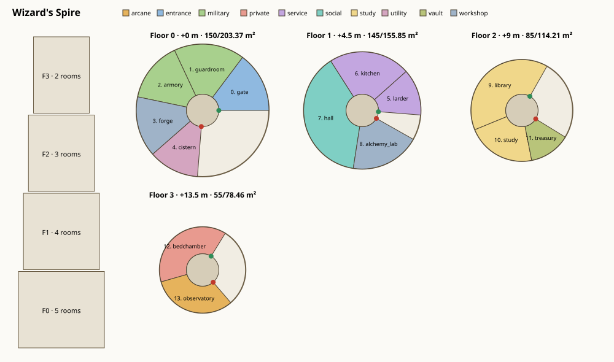

# Gamedev_Root

## towergen — tower blueprint creator

Turns a **program graph** (rooms as nodes, spatial relationships as weighted
edges) into a multi-floor tower blueprint using **Hamiltonian convolution**
and a **Hamiltonian-path** circulation route. It's plain Python 3.10+ with no
dependencies, and it writes JSON that any engine can import, plus an SVG
preview.

```sh
python -m towergen examples/wizard_tower.json -o out/
python -m unittest            # tests
```



### Pipeline

| Stage | Module | What happens |
|---|---|---|
| 1. Program graph | `graph.py` | Rooms (`area`, `weight`, `height_pref`, `anchor`) and edges (`adjacent` / `separate`). |
| 2. Hamiltonian convolution | `hamiltonian.py` | Each room gets a state `(z, u, v)` (height and bearing around the tower). Stacked layers of damped Hamiltonian dynamics relax it under an energy `V(x)`. See below. |
| 3. Floor discretization | `floors.py` | Sizes the tower (tapered floor capacity), fills floors in embedded-height order, then runs Metropolis annealing on a discrete Hamiltonian (adjacency, separation, gravity, preference, overflow). |
| 4. Hamiltonian-path circulation | `circulation.py` | One route visits every room exactly once. Held–Karp solves each floor exactly (nearest-neighbour + 2-opt above 12 rooms per floor). Each floor's entry is conditioned on where the stair from the previous floor ended. |
| 5. Layout | `blueprint.py` | Rooms become annular wedges around a stair core, laid out in route order. The spiral stair climbs `stair_sweep`° from each floor's exit to the next floor's landing. |

### The Hamiltonian convolution

```
V(x) = ½ Σ W_ij |x_i − x_j|²              adjacency springs  (= xᵀLx)
     + Σ S_ij exp(−|x_i − x_j|²/σ²)        "separate" repulsion
     + γ Σ exp(−|x_i − x_j|²/σ²)           crowding
     + α Σ weight_i · z_i                  gravity: heavy rooms sink
     + β Σ (z_i − pref_i)²  + κ·anchors
H(x, p) = ½|p|² + V(x)
```

One layer is a damped symplectic-Euler step: `p ← μp − η∇V(x)`, `x ← x + ηp`.
∇V is computed by message passing over the graph. For the spring term alone,
the step reduces to the graph convolution `x ← (I − η²L)x`, a first-order
approximation of the propagator `exp(−τL)`. Stacking layers spreads
constraints across the whole program. Momentum lets the embedding escape
shallow minima.

### Program format

```json
{
  "name": "Wizard's Spire",
  "tower": {"base_radius": 9, "taper": 0.35, "core_radius": 2.2, "floor_height": 4.5},
  "rooms": [
    {"id": "gate",  "kind": "entrance", "area": 30, "anchor": "ground"},
    {"id": "forge", "kind": "workshop", "area": 30, "weight": 3.0},
    {"id": "study", "kind": "study",    "area": 25, "height_pref": 0.75}
  ],
  "edges": [
    {"a": "gate", "b": "forge", "weight": 1},
    {"a": "forge", "b": "study", "kind": "separate", "weight": 3}
  ]
}
```

Tower options (`TowerSpec`): `base_radius`, `taper`, `core_radius`,
`floor_height`, `efficiency`, `slack`, `stair_sweep`, `min_floors`,
`max_floors`. A room of kind `entrance` is where the route starts.

### Output

`<name>.blueprint.json` contains:

- floors: elevation, radius, capacity, load, stair landing and exit angles
- rooms: floor, wedge angles and radii, position along the route
- the full route
- metrics: energy traces, which adjacency and separation edges were satisfied, and the raw embedding
